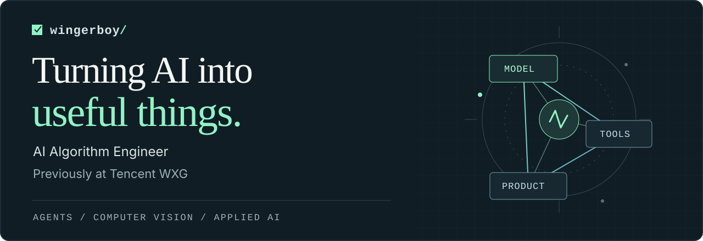

<picture>
  <source media="(max-width: 600px)" srcset="./hero-mobile.svg">
  
</picture>

### From algorithms to things people can use.

I'm **wingerboy**, an **AI Algorithm Engineer**, previously at **Tencent WXG (Weixin Group)**. I build AI agents, computer vision tools, and practical AI applications.

曾在腾讯微信事业群担任 AI 算法工程师。关注模型如何接入工具、融入工作流，最终成为真正能用的产品。

**Explore:** [Selected builds](#selected-builds) · [Engineering interests](#engineering-interests) · [Let's connect](#lets-connect)

## Selected builds

<table>
<tr>
<td width="50%" valign="top">
<h3><a href="https://github.com/wingerboy/cursor-agent">cursor-agent ↗</a></h3>
<strong>Inside a coding agent</strong>

Architecture notes and a minimal runnable demo exploring planning, execution, and verification.

从任务规划到执行验证，拆解 Coding Agent 的工作方式。

<code>TypeScript</code> <code>Agent Architecture</code>

</td>
<td width="50%" valign="top">
<h3><a href="https://github.com/wingerboy/video_matting">video_matting ↗</a></h3>
<strong>Computer vision, put to work</strong>

Video foreground extraction and background replacement using BEN2 and BiRefNet models, with a FastAPI service.

把视频抠图模型接入处理流程与服务接口。

<code>Python</code> <code>PyTorch</code> <code>FastAPI</code>

</td>
</tr>
<tr>
<td width="50%" valign="top">
<h3><a href="https://github.com/wingerboy/MediaBot">MediaBot ↗</a></h3>
<strong>Configurable browser workflows</strong>

A Python and Playwright project for configurable social media tasks, content filters, and session management.

将浏览器操作组织成可配置、可追踪的自动化任务。

<code>Python</code> <code>Playwright</code> <code>Automation</code>

</td>
<td width="50%" valign="top">
<h3><a href="https://github.com/wingerboy/faceRecognition">faceRecognition ↗</a></h3>
<strong>Where my vision projects began</strong>

A desktop face recognition project with a PyQt interface and support for adding new faces.

早期计算机视觉实践：从人脸识别到桌面交互。

<code>Python</code> <code>OpenCV</code> <code>dlib</code>

</td>
</tr>
</table>

A mix of demos, tools, and experiments. See each repository for setup and scope.

## Engineering interests

- **AI agents** — planning, tool use, memory, and verification.
- **Computer vision** — image understanding, foreground extraction, and video processing.
- **Applied AI** — connecting models, APIs, and interfaces into useful workflows.

**Across these projects:** `Python` · `TypeScript` · `PyTorch` · `OpenCV` · `FastAPI` · `Playwright`

## Let's connect

I enjoy exchanging ideas with AI builders and turning promising ideas into working software. **Open to open-source collaboration and AI project partnerships.**

欢迎交流技术、一起做开源，也欢迎带着具体场景聊 AI 项目合作。

[**Start a conversation →**](https://github.com/wingerboy/wingerboy/issues) &nbsp; · &nbsp; [Browse my repositories](https://github.com/wingerboy?tab=repositories)

Have a project idea? Share the problem, the current workflow, and what a useful result would look like.
